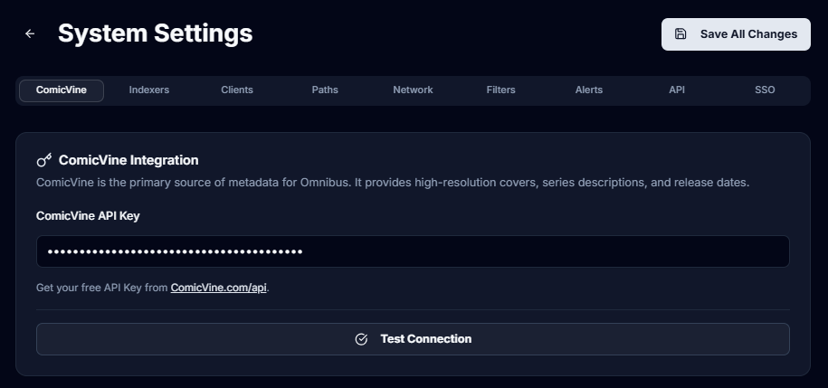

# 📚 Omnibus

 **Omnibus** is an all-in-one, self-hosted web application built specifically for the comic book and manga community. It seamlessly bridges the gap between discovering, requesting, downloading, managing, and reading your digital collection. 

Built with a modern tech stack (Next.js 15, Tailwind v4, Prisma, and SQLite), Omnibus is designed to be lightweight, incredibly fast, and beautiful across all your devices. Whether you are managing a massive archive of `.cbz` and `.cbr` files or just looking for a clean web reader, Omnibus brings your entire comic universe under one roof.

---

## 📑 Table of Contents
- [About Omnibus](#about-omnibus)
- [Features & Navigation](#features--navigation)
  - [🏠 Dashboard](#-dashboard)
  - [📚 The Library](#-the-library)
  - [📖 Web Reader](#-web-reader)
  - [🔍 Discovery & Search](#-discovery--search)
  - [⬇️ Requests & Downloads](#️-requests--downloads)
  - [📋 Reading Lists](#-reading-lists)
  - [⚙️ Settings & Administration](#️-settings--administration)
- [🚀 Installation (Docker)](#-installation-docker)
- [🙏 Acknowledgements](#-acknowledgements)

---

## Features & Navigation

### 🏠 Dashboard
The nerve center of your collection, providing a quick glance at your ongoing reading journey.
 * **Continue Reading:** Instantly jump back into the exact page of the issue you were reading last.
* **Recently Added:** Browse the latest issues and volumes that have hit your server.
* **Server Statistics:** Get a quick overview of your total series, issues, and storage usage.

### 📚 The Library
A meticulously organized view of your physical files, built to handle massive collections without breaking a sweat.
 * **Infinite Scroll:** Browse thousands of covers seamlessly.
* **Series vs. Issue View:** Toggle between browsing top-level series folders or individual issues.
* **Advanced Filtering:** Filter by Publisher, Genre, Status, or file type (Comic vs. Manga).
* **Metadata Parsing:** Automatically extracts embedded ComicInfo.xml data for accurate titles and summaries.

### 📖 Web Reader
A completely custom, zero-friction reading experience right in your browser.
 * **Format Support:** Native reading for `.cbz`, `.cbr`, and `.epub`.
* **Manga Mode:** One-click toggle for Right-to-Left (RTL) reading.
* **Page Layouts:** Choose between Single Page, Double Page spread, or continuous vertical scrolling.
* **Progress Tracking:** Automatically remembers your page and syncs across devices.

### 🔍 Discovery & Search
Integrated directly with ComicVine to help you find the missing pieces of your collection.
 * **ComicVine Integration:** Pull accurate metadata, release dates, and high-res covers.
* **Smart Search:** Find distinct series runs (e.g., distinguishing between Batman 1940 and Batman 2011).
* **One-Click Requests:** Instantly send a missing issue or whole series to your download queue.

### ⬇️ Requests & Downloads
Your automated librarian. Tell Omnibus what you want, and it handles the rest.
 * **Queue Management:** View active, pending, and completed downloads.
* **Client Integration:** Connects with your favorite torrent or NZB clients behind the scenes.
* **Auto-Importing:** Once downloaded, files are automatically renamed, organized, and added to the library.

### 📋 Reading Lists
Perfect for massive comic book crossover events or curated reading orders.
 * **Custom Curations:** Create custom lists spanning multiple series and publishers.
* **Event Tracking:** Keep track of complex reading orders (e.g., *Infinity Gauntlet*, *Secret Wars*).
* **Shareable:** (Coming Soon) Share your reading orders with other users on your server.

### ⚙️ Settings & Administration
Complete control over your instance and users.
 * **User Management:** Create accounts, restrict access, and manage user roles.
* **Library Paths:** Map your NAS directories directly to Omnibus.
* **API Configuration:** Easily plug in your ComicVine API key and Download Client credentials.
* **Theme Customization:** Toggle Dark/Light modes and UI preferences.

---

## 🚀 Installation (Docker)

Omnibus is built to be deployed via Docker, containing its own bundled SQLite database. There are no external database containers required!

1. Save the following as `docker-compose.yml`:

```yaml
version: '3.8'

services:
  omnibus:
    image: ghcr.io/hankscafe/omnibus:latest
    container_name: omnibus
    restart: unless-stopped
    ports:
      - "3000:3000"
    environment:
      # REQUIRED: Change to your NAS IP or your domain (e.g., [https://omnibus.mydomain.com](https://omnibus.mydomain.com))
      - NEXTAUTH_URL=[http://192.168.1.100:3000](http://192.168.1.100:3000) 
      # REQUIRED: Generate a random string for security
      - NEXTAUTH_SECRET=super_secret_generated_key_123!
    volumes:
      # Map your local config folder to store the SQLite database
      - /path/to/your/nas/config:/app/prisma
      # Map your comic/manga storage
      - /path/to/your/nas/comics:/comics
      - /path/to/your/nas/downloads:/downloads