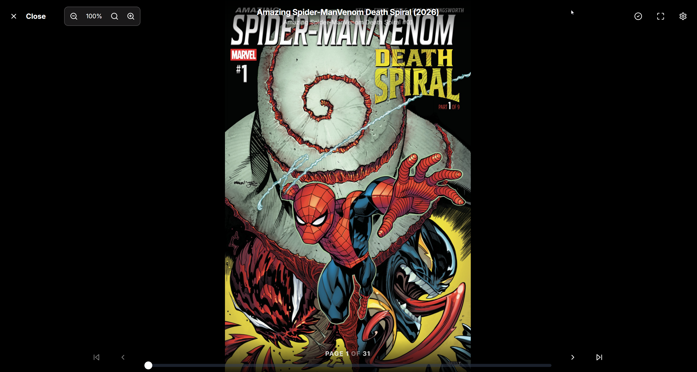
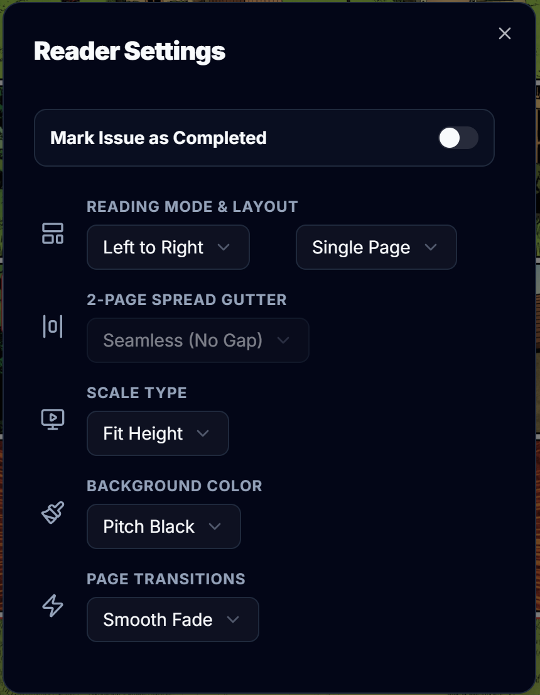

# Omnibus

<p align="center">
  
  <br>
  <em>The ultimate all-in-one, self-hosted comic book and manga app.</em>
</p>

<p align="center">
  <a href="https://github.com/hankscafe/omnibus/actions">
    
  </a>
  <a href="https://github.com/hankscafe/omnibus/pkgs/container/omnibus">
    
  </a>
  <a href="https://github.com/hankscafe/omnibus/blob/main/LICENSE">
    
  </a>
  <a href="https://github.com/hankscafe/omnibus/stargazers">
    
  </a>
  <a href="https://discord.gg/FBnzdBZP">
    
  </a>
</p>

**Omnibus** is the ultimate all-in-one, self-hosted web application built specifically for the comic book and manga community. It seamlessly bridges the gap between discovering, requesting, downloading, managing, and reading your digital collection.

I am not a traditional programmer, but I was inspired to "vibe-code" this project after discovering [ReadMeABook](https://github.com/kikootwo/ReadMeABook) on Reddit.

Self-hosting audiobooks, eBooks, and comic books has always presented a challenge for me: how do you seamlessly handle user requests, find the files, and automatically add them to a library? Having a system like [AudioBookShelf](https://github.com/advplyr/audiobookshelf) for managing metadata and streaming media is fantastic, but getting the files into the system and handling user requests usually meant manual searching or relying on a disjointed mix of auto-downloaders.

After using [ReadMeABook](https://github.com/kikootwo/ReadMeABook), I wanted a similar solution specifically tailored for comics. Comic indexers and tracking sites can be notoriously tricky due to inconsistent naming conventions and release formats (e.g., single issues vs. volumes vs. massive character collections). Using ReadMeABook's clean aesthetic as a starting point, I used AI to help build a comic-focused equivalent. What started as a simple request tool eventually evolved into a full-fledged library manager, metadata indexer, and web reader.

Built with Next.js 15, Tailwind v4, Prisma, and a serverless SQLite engine, Omnibus is designed to be lightweight, performant, and responsive across all your devices. Whether you are managing a massive archive of .cbz and .cbr files, hunting down missing issues of your favorite run, or just looking for a clean, distraction-free web reader, Omnibus brings your entire comic universe under one roof.

While I know AI-assisted ("vibe-coded") projects can sometimes be met with skepticism, I genuinely enjoyed the process of watching this come together into a highly usable tool. If you run into issues, have suggestions, or want to contribute, please let me know! I gladly welcome any help or insights to make Omnibus even better.

---

## Table of Contents
- [About Omnibus](#about-omnibus)
- [Features & Navigation](#features--navigation)
  - [Authentication & Security](#authentication--security)
  - [Homepage](#homepage)
  - [Library & Metadata](#library--metadata)
  - [Series Page](#series-page)
  - [Web Reader](#web-reader)
  - [Reading Lists](#reading-lists)
  - [User Profile & Preferences](#user-profile--preferences)
  - [Settings & Administration](#settings--administration)
  - [Additional Screenshots](#additional-screenshots)
- [Installation (Docker)](#installation-docker)
- [Acknowledgements](#acknowledgements)

---

## Features & Navigation

### Authentication & Security
The secure gateway to your personal comic universe. Omnibus ensures your collection remains private while offering a beautiful, welcoming entry point for you and your authorized users.

<p align="center">
  
  <br>
  <strong>Login page.</strong>
</p>

* **Secure Local Access:** Powered by NextAuth, featuring industry-standard encrypted sessions to keep your server, database, and physical files completely safe from the public internet.
* **Single Sign-On (SSO):** Natively supports OpenID Connect (OIDC). Integrate directly with Authelia, Authentik, Keycloak, or Google for seamless user onboarding.
* **Two-Factor Authentication (2FA):** Users can secure their local accounts using TOTP authenticator apps (Google Authenticator, Authy, Bitwarden).
* **Multi-User Gateway & Impersonation:** Create independent accounts for friends and family. Admins can even temporarily "Impersonate" users to help troubleshoot their accounts.
* **Active Session Management:** Logged in on a public computer? Revoke all other active sessions directly from your profile settings.
* **First-Time Setup Detection:** If the database is completely fresh and no administrator account exists yet, the login system intelligently redirects to the built-in Setup Wizard to help you configure your libraries.

### Homepage
The Dashboard is the personalized nerve center of your collection. It dynamically updates based on the logged-in user to provide a tailored snapshot of their reading journey.

<p align="center">
  
  <br>
  <strong>Jump Back In section.</strong>
</p>

<p align="center">
  
  <br>
  <strong>Homepage discovery section with Popular Issues and New Releases.</strong>
</p>

<p align="center">
  
  <br>
  <strong>Series window when clicking issue/series from the discover sections.</strong>
</p>

<p align="center">
  
  <br>
  <strong>Users can choose to monitor the series when they are making a request so future releases to a series will be automatically downloaded.</strong>
</p>

* **Responsive Design:** A beautifully styled, mobile-first interface that provides a frictionless login experience whether you are on a smartphone, tablet, or desktop monitor.
* **"Jump Back In" Shelf:** A dynamically updated carousel that tracks your exact page in ongoing issues. Jump back into the action with a single click.
* **Recently Added" Section:** A dynamically updated carousel that shows the 7 most recent series addtions to the library with the ability to jump directly to that series page.
* **Discovery Feed:** Browse auto-updating "New Releases" and "Popular Issues" pulled directly from the ComicVine API and cached for performance.
* **Interactive Search:** Search the ComicVine database for any series or issue. View covers, publishers, and issue counts to ensure you are requesting exactly what you want.
* **Smart Requests & Automation:** Send requests directly to your download queue. Omnibus searches your connected indexers (Prowlarr) and gracefully falls back to direct downloads (GetComics) if torrents/usenet fail.
* **Upcoming Release Tracking:** Monitors your requested ongoing series for new weekly Wednesday releases and automatically grabs them as they are uploaded.
* **Unreleased Badges:** When a request is made Omnibus will check ComicVine for the issues release date and if it is not released it will tag it as UNRELEASED.  As the Monitor Series job runs it will also check items tagged as UNRELEASED and update it as available once it is availalbe, allowing future issues to be automatically downloaded.
* **Admin Action Alerts:** Admins get a top-level heads-up display alerting them of pending user approvals, manual download interventions, and broken file reports.

<p align="center">
  
  <br>
  <strong>If a user submits an issue with a series or a request is waiting on admin approval, a banner will be visible to admins on the homepage.</strong>
</p>

### Library & Metadata
A meticulously organized, highly performant view of your physical files, built to handle massive, multi-terabyte collections smoothly.

<p align="center">
  
  <br>
  <strong>The library page which features infinite scrolling.</strong>
</p>

<p align="center">
  
  <br>
  <strong>The library page action buttons.</strong>
</p>

* **Dual Megadata Engines:** Omnibus reads embedded ComicInfo.xml files inside your archives and syncs with the ComicVine API to pull high-res covers, synopses, and creator credits.
* **Multi-Library Routing:** Map distinct folders for standard Comics and Manga. Omnibus automatically detects Manga based on publishers, AniList cross-referencing, and tags to route them to the correct directory.
* **Automated File Standardization:** * Enforce clean, uniform file names across your entire server (e.g., [Publisher]/Series (Year)/Series - #Issue.cbz).
* **Deep Filtering & Sorting:** Filter by Publisher, Genre, Format, Era (1980s, 1990s, etc.), and Read Status.
  * Try the "Surprise Me" button for a randomized library shuffle when you don't know what to read!
* **Smart Progress Badging:** Visual overlay indicators on covers to instantly show reading progress bars and how many unread issues remain in a series.
* **Cross-Series Curations:** Create custom lists that span multiple series, volumes, and publishers seamlessly.
* **Issue Grid & List Modes:** Toggle between a visual cover grid or a condensed list view to easily navigate massive collections.

### Series Page
The dedicated hub for an individual comic run or manga volume. This page aggregates all metadata, reading progress, and file management for a specific series into one beautiful layout.

<p align="center">
  
  <br>
  <strong>A series page showing a series that currently has all available issues.</strong>
</p>

<p align="center">
  
  <br>
  <strong>A series page showing a series that currently has all available issues.</strong>
</p>

* **Hero Banner & Synopsis:** A premium, visually striking header displaying high-resolution cover art, publisher logos, release years, and a full story synopsis pulled directly from ComicVine.
* **ComicVine Button:** A button that will take users directly to the series page on ComicVine.
* **Granular Metadata:** View detailed credits including Writers, Artists, Colorists, and Cover Artists, alongside genre tags and character appearances.
* **"Read Next" Prompts:** A smart action button that instantly opens the web reader to your exact saved page on the next unread issue in the run.
* **Issue Grid & List Modes:** Toggle between a visual cover grid or a condensed list view to easily navigate massive, 100+ issue runs.
* **Individual Progress Tracking:** Every issue displays its own distinct status (Unread, In Progress with a visual progress bar, or Read). 
* **Bulk Actions:** Effortlessly manage your collection with one-click buttons to "Mark All as Read," "Refresh Metadata," or delete specific files right from the browser.
* **Missing Issue Detection:** Visually highlights gaps in your collection (e.g., if you have issues #1 and #3, it flags #2 as missing). Click "Request Missing" to queue them all up at once.
* **Sorting Options:** Sort issues sequentially (Issue # 1 to # 100) or reverse chronological (newest releases first) for ongoing weekly pulls.
* **Offline Downloading:** Admins can grant users permission to download raw .cbz or .cbr files directly from the browser for offline reading in third-party apps.

### Web Reader
A completely custom, zero-friction reading experience built natively into the browser. No external apps required.

<p align="center">
  
  <br>
  <strong>Reader page and controls.</strong>
</p>

<p align="center">
  
  <br>
  <strong>Reader page settings.</strong>
</p>

* **Universal Format Support:** Native, blazing-fast extraction and rendering for `.cbz`, `.cbr`, and `.epub` archives.
* **Reading Directions:** One-click toggles for Left-to-Right (Standard Comics), Right-to-Left (Manga), and continuous Vertical Scrolling (Webtoons).
* **Dynamic Page Layouts:** Single Page, Double Page, or "Double Page (No Cover)" to preserve correct spread alignments.
  * Adjust the gutter gap between 2-page spreads (Seamless, Small, Large).
  * Auto-Fit toggles: Fit to Width, Fit to Height, Screen, or Original Resolution.
* **Smart Preloading:** Silently caches the next several pages in the background so you never experience loading spinners while reading.
* **Control Schemes:** Fully mapped keyboard shortcuts for desktop readers (Arrow keys, Spacebar, F to Fullscreen), and intuitive tap/swipe zones for mobile and tablet users.
* **Live Image Adjustments:** Adjust brightness and contrast overlays independently of your device settings for late-night reading sessions.

### Reading Lists (Story Arcs)
Perfect for navigating the complex web of massive comic book crossover events or creating your own curated reading orders.

<p align="center">
  
  <br>
  <strong>Reading lists page showing 2 story arcs added.</strong>
</p>

* **Auto-Build Story Arcs:** Input a ComicVine Event ID (e.g., Marvel Civil War, Secret Wars, Flashpoint), and Omnibus will instantly generate the complete official reading order and automatically link the physical files you already own!
* **Bulk Missing Requests:** With one click, ask Omnibus to track down and download every issue you are missing from a massive crossover event.
* **Manual Drag-and-Drop:** Easily reorder issues within your lists with a simple drag-and-drop interface.
* **Dynamic Smart Lists:** Create lists that automatically populate based on tags, characters, or publishers.
* **Global vs Private Lists:** Admins can publish reading lists globally for all users, while users can curate private collections.

### User Profile & Preferences
A personalized space for each user on your server to manage their identity, track their unique reading habits, and customize their Omnibus experience to fit their workflow.

<p align="center">
  
  <br>
  <strong>Users profile page showing customizable header and avatar.</strong>
</p>

<p align="center">
  
  <br>
  <strong>Users profile page reading progress cards.</strong>
</p>

<p align="center">
  
  <br>
  <strong>Users profile page showing recent request history.</strong>
</p>

<p align="center">
  
  <br>
  <strong>Users profile menu from header where you can log out or change password.</strong>
</p>

* **Personal Identity:** Customize your account by uploading a unique profile avatar and a custom hero banner for your user dashboard.
* **Reading Statistics:** Track your all-time reading habits. View your total issues read, estimated pages turned, and your most-read publishers or genres.
* **UI Customization:** Set your own personal theme preferences (Dark mode, Light mode, or System default) and UI accent colors. These settings are tied to your account and persist across any device you log into.
* **Default Reader Settings:** Save your preferred Web Reader behaviors (e.g., always default to "Fit to Width" or default to "Right-to-Left" for manga libraries) so you never have to adjust settings when starting a new book.
* **Account Security:** Safely update your password and view or revoke active login sessions *(Coming Soon)* across your different devices.
* **Personal API Keys:** *(Coming Soon)* Generate secure, user-specific API tokens to integrate your Omnibus reading progress with third-party trackers (like MyAnimeList, AniList, or custom scripts) without giving out Admin access.
* **Theme Customization:** Toggle Dark/Light modes, adjust UI accent colors, and tailor the app to your visual preferences.

### Settings & Administration
Complete, granular control over your instance, your users, and your underlying automation.

<p align="center">
  
  <br>
  <strong>Admin page showing data cards and configuration pages.</strong>
</p>

<p align="center">
  
  <br>
  <strong>Admin page showing active downloads and request management sections.</strong>
</p> 

* **Download Client Integration:** Connects seamlessly with qBittorrent, Deluge, SABnzbd, and NZBGet. Supports complex Docker remote-path mapping to ensure files move perfectly between containers.
* **Smart Matcher:** An AI-assisted tool that scans your "Unmatched" folders, queries ComicVine, and suggests the correct metadata linkage so you can clean up messy archives in seconds.
* **Deep Diagnostics Engine:**
  * Ghost Records: Find and purge database entries pointing to files you deleted outside of Omnibus.
  * Orphaned Files: Find comic files sitting on your hard drive that Omnibus hasn't indexed, saving you wasted disk space.
  * Archive Integrity: Scan your .cbz files to detect corrupted or incomplete zip archives.
* **Storage Analytics:** A beautiful visual dashboard breaking down your storage usage by publisher, tracking user engagement, and highlighting "Inactive Series" that you might want to delete to free up space.
* **Indexer Support:** Plug in Prowlarr or Jackett to search dozens of trackers simultaneously, and use torznab IDs to prevent unwanted results.
* **Queue & History Management:** View active, pending, paused, and completed downloads with real-time progress bars, speeds, and ETA.
* **Automated Post-Processing:** Once a comic is downloaded, Omnibus automatically:
  1. Extracts the file (if necessary).
  2. Renames the file to your customized standard format.
  3. Moves it to the correct publisher/series directory on your NAS.
  4. Triggers a local library scan to make it instantly readable.
* **User & Role Management:** * Create independent accounts for friends and family so everyone has their own reading progress.
  * Admin or User roles
  * Users can be assigned auto-approval permission and download permission
* **Library Path Mapping:** Omnibus supports multiple libraries to easily map multiple root directories from your NAS (e.g., separate folders for `/comics`, `/manga`, and `/magazines`).
* **API & Service Configuration:** Securely plug in your ComicVine API keys, Indexer credentials, and Download Client details.
* [**External API Integrations:**](./docs/API.md) Generate an API key to allow external applications (like Discord Bots or Dashboards) to fetch stats and interact with Omnibus securely.
* **Scheduled Tasks (Cron):** Configure how often Omnibus should scan your disk for new files, refresh metadata, or check indexers for missing requested issues.
* **Live System Logs:** A built-in log viewer to easily troubleshoot API limits, failed downloads, or matching errors.

---

## Additional Screenshots

<table align="center" style="border: none;">
  <tr>
    <td align="center">
      <a href="docs/images/analytics_1.png">
        
      </a>
    </td>
    <td align="center">
      <a href="docs/images/analytics_2.png">
        
      </a>
    </td>
    <td align="center">
      <a href="docs/images/approvals.png">
        
      </a>
    </td>
  </tr>
  <tr>
    <td align="center">
      <a href="docs/images/diagnostics.png">
        
      </a>
    </td>
    <td align="center">
      <a href="docs/images/issue_reports_1.png">
        
      </a>
    </td>
    <td align="center">
      <a href="docs/images/issue_reports_2.png">
        
      </a>
    </td>
  </tr>
  <tr>
    <td align="center">
      <a href="docs/images/issue_reports_3.png">
        
      </a>
    </td>
    <td align="center">
      <a href="docs/images/my_requests.png">
        
      </a>
    </td>
    <td align="center">
      <a href="docs/images/smart_matcher.png">
        
      </a>
    </td>
  </tr>
  <tr>
    <td align="center">
      <a href="docs/images/storage_deep_dive.png">
        
      </a>
    </td>
    <td align="center">
      <a href="docs/images/system_logs_1.png">
        
      </a>
    </td>
    <td align="center">
      <a href="docs/images/system_logs_2.png">
        
      </a>
    </td>
  </tr>
  <tr>
    <td align="center">
      <a href="docs/images/users.png">
        
      </a>
    </td>
    <td></td>
    <td></td>
  </tr>
</table>

---

## Installation (Docker)

Omnibus is built to be deployed via Docker. Because it utilizes a serverless SQLite engine through Prisma, **all necessary database files and dependencies are bundled directly into the image.** There are no external database containers required!

1. Save the following as `docker-compose.yml`:

```yaml
version: '3.8'

services:
  omnibus:
    image: ghcr.io/hankscafe/omnibus:latest
    container_name: omnibus
    restart: unless-stopped
    ports:
      - "3000:3000"
    environment:
      - TZ=America/New_York
      # REQUIRED: Set to your Cloudflare Tunnel domain (e.g., https://omnibus.mydomain.com)
      # or your NAS IP (e.g., http://192.168.1.100:3000)
      - NEXTAUTH_URL=http://192.168.1.100:3000
      # REQUIRED: Generate a random string for security
      - NEXTAUTH_SECRET=super_secret_generated_key_123!
      # REQUIRED: Tells the app to store the database in our persistent config mount
      - DATABASE_URL=file:/config/omnibus.db
      # OPTIONAL: Tells the app what path to use for the database backups, if not used Omnibus will default to /backups
      - OMNIBUS_BACKUP_DIR=/backups

    volumes:
      # REQUIRED: Persistent storage for your database, logs, and settings
      - /path/to/your/nas/config:/config
      # REQUIRED: Maps backup folder for database backups (can be defined using environment variable)
      - /path/to/your/nas/backups:/backups
      # REQUIRED: Persistent storage for user avatars and banners
      - /path/to/your/nas/avatars:/app/public/avatars
      - /path/to/your/nas/banners:/app/public/banners
      # -------------------------------------------------------------------------
      # OPTION 1: The Recommended Single Data Mount (Fast Atomic Moves/Hardlinks)
      # -------------------------------------------------------------------------
      # Maps your entire media/download root to /data for optimal performance
      - /path/to/your/nas/data:/data 
      # -------------------------------------------------------------------------
      # OPTION 2: Separate Mounts (Slower copy/paste/delete operations)
      # Uncomment these and remove Option 1 if your folders are on different drives
      # -------------------------------------------------------------------------
      # - /path/to/your/nas/comics:/comics
      # - /path/to/your/nas/manga:/manga
      # - /path/to/your/nas/downloads:/downloads
```

2. Run `docker-compose up -d`.
3. Open your browser and navigate to your `NEXTAUTH_URL` to access the Setup Wizard!

---

## Acknowledgements

Omnibus stands on the shoulders of giants. This project was heavily inspired by and built with immense respect for the developers of the following incredible self-hosted applications:

* **[Kavita](https://www.kavitareader.com/):** For setting the gold standard in self-hosted reading and library management.
* **[Komga](https://komga.org/):** For their incredible work in the digital comic management space.
* **[Kapowarr](https://github.com/Casvt/Kapowarr):** For pioneering modern comic book request and download automation.
* **[Mylar3](https://github.com/mylar3/mylar3):** The absolute titan of comic tracking and downloading that paved the way.
* **[ReadMeABook](https://github.com/kikootwo/ReadMeABook):** For the beautiful UI/UX inspiration and demonstrating what a modern web reader can look like.
* **[ComicVine](https://comicvine.gamespot.com/):** For providing the API and metadata backbone that keeps our digital collections accurate and beautiful.

---

## Contributors
- **Gemini** - AI Technical Collaborator & Project Advisor
