# Omnibus

<p align="center">
  
</p>

**Omnibus** is the ultimate all-in-one, self-hosted web application built specifically for the comic book and manga community. It seamlessly bridges the gap between discovering, requesting, downloading, managing, and reading your digital collection.

I am not a programming but I was inspired to vibe-code this project after coming across [ReadMeABook](https://github.com/kikootwo/ReadMeABook) on Reddit.  Audiobooks, eBooks and comic books have been a challenge for myself when self hosting.  Having a system like [AudioBookShelf](https://github.com/advplyr/audiobookshelf) for managing the metadata and allowing users to listen to the books is fantastic, but how do you get them to AudioBookShelf?  Users would ask and I would add them manually or rely on a separate system that would autodownload Audible books into a library.

I once I started using [ReadMeABook](https://github.com/kikootwo/ReadMeABook) I wanted something that would work for comics, understanding that indexers and other sites for comics can be tricky due to naming and availability (single issue or series vs a collection of every comic realted to a certain character).  I took the initial look of [ReadMeABook](https://github.com/kikootwo/ReadMeABook) and begin using AI to help create something specific for comics.  It eventaully moved beyone just a requesting tool, into a library management and metadata tool, and then into a reader as well.

Built with Next.js 15, Tailwind v4, Prisma, and a serverless SQLite engine, Omnibus is designed to be lightweight, performant, and responsive across all your devices. Whether you are managing a massive archive of `.cbz` and `.cbr` files, hunting down missing issues of your favorite run, or just looking for a clean, distraction-free web reader, Omnibus brings your entire comic universe under one roof.

I know people aren't fond of AI built (vibe-coded) projects, but I enjoyed the process and it was interesting to see it come tegether and into something usable.  If you have issues or suggestions, please let me know.  I will gladly take additional help or insight to making the project better.

---

## Table of Contents
- [About Omnibus](#about-omnibus)
- [Features & Navigation](#features--navigation)
  - [Authentication & Login](#authentication--login)
  - [Homepage](#homepage)
  - [Library](#library)
  - [Series Page](#series-page)
  - [Web Reader](#web-reader)
  - [Reading Lists](#reading-lists)
  - [User Profile & Preferences](#user-profile--preferences)
  - [Settings & Administration](#settings--administration)
  - [Additional Screenshots](#additional-screenshots)
- [Installation (Docker)](#installation-docker)
- [Acknowledgements](#acknowledgements)

---

## Features & Navigation

### Authentication & Login
The secure gateway to your personal comic universe. Omnibus ensures your collection remains private while offering a beautiful, welcoming entry point for you and your authorized users.

<p align="center">
  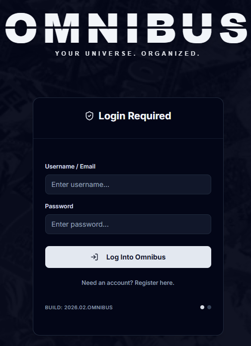
  <br>
  <strong>Login page.</strong>
</p>

* **Secure Access:** Powered by NextAuth, featuring industry-standard encrypted sessions to keep your server, database, and physical files completely safe from the public internet.
* **Multi-User Gateway:** A single portal for the server administrator, family members, or friends to log into their distinct, personalized accounts.
* **Responsive Design:** A beautifully styled, mobile-first interface that provides a frictionless login experience whether you are on a smartphone, tablet, or desktop monitor.
* **First-Time Setup Detection:** If the database is completely fresh and no administrator account exists yet, the login system intelligently redirects to the built-in Setup Wizard to help you configure your libraries.

### Homepage
The Dashboard is the personalized nerve center of your collection. It dynamically updates based on the logged-in user to provide a tailored snapshot of their reading journey.

<p align="center">
  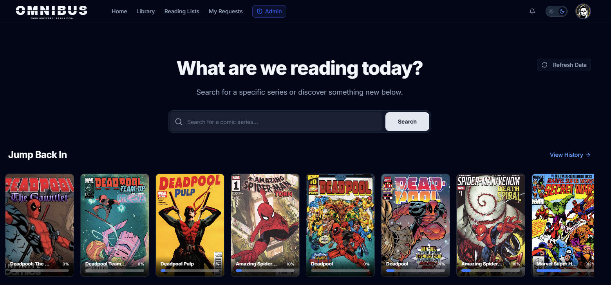
  <br>
  <strong>Jump Back In section.</strong>
</p>

<p align="center">
  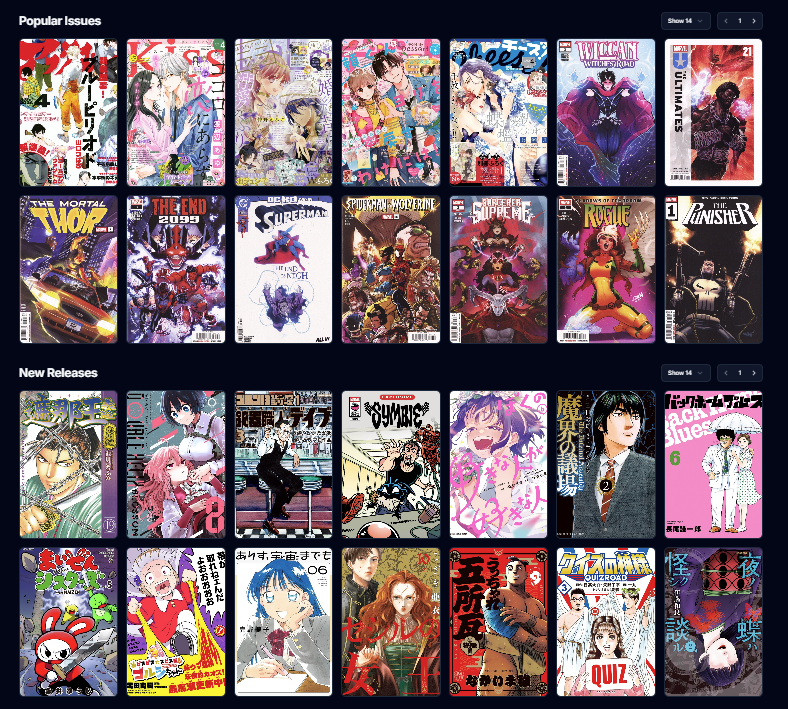
  <br>
  <strong>Homepage discovery section with Popular Issues and New Releases.</strong>
</p>

<p align="center">
  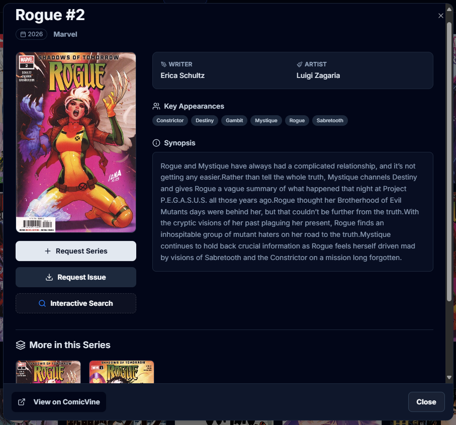
  <br>
  <strong>Series window when clicking issue/series from the discover sections.</strong>
</p>

<p align="center">
  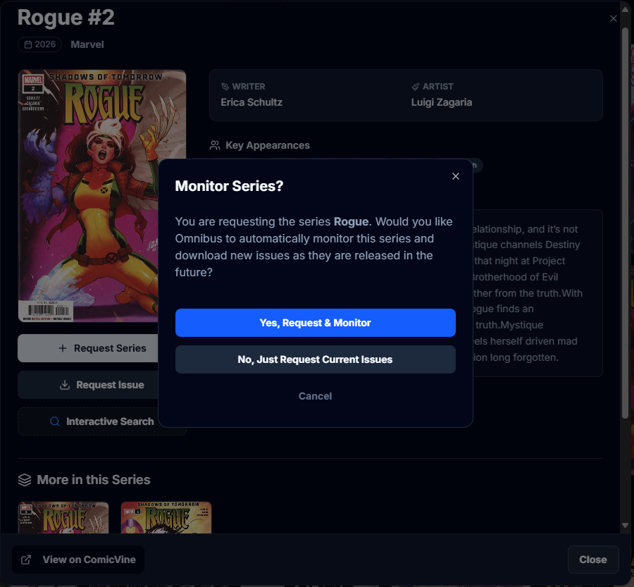
  <br>
  <strong>Users can choose to monitor the series when they are making a request so future releases to a series will be automatically downloaded.</strong>
</p>

* **"Jump Back In" Shelf:** A dynamically updated carousel that tracks your exact page in ongoing issues. Jump back into the action with a single click.
* **Popular Issues:** Uses ComicVines api to pull a list of popular issues/series that is cached to help performance and is updated using a scheduled task in the admin section, or using the "Refresh Data" button on the homepage.
* **New Releases:** Uses ComicVines api to pull a list of new releases that is cached to help performance and is updated using a scheduled task in the admin section, or using the "Refresh Data" button on the homepage.
* **Manual Search:** A manual search powered by ComicVines api where users can input any series they want and choose from the results which show cover images, publisher, year, and issue count to ensure they are selecting the issue or series they are looking for.
* **One-Click Requests:** Found a missing issue or an entire story arc? Click "Request" to instantly send it to your automated download queue.
* **Upcoming Release Tracking:** Monitors your requested ongoing series for new weekly Wednesday releases and automatically grabs them as they are uploaded.
* **Requests & Downloads:** Your automated librarian. Tell Omnibus what you want, and it handles the complex world of tracking, downloading, and organizing.
* **Admin Alerts:** When an issue is reported or a request requires approval a banner will be visible on the home page with links to the appropriate pages.

<p align="center">
  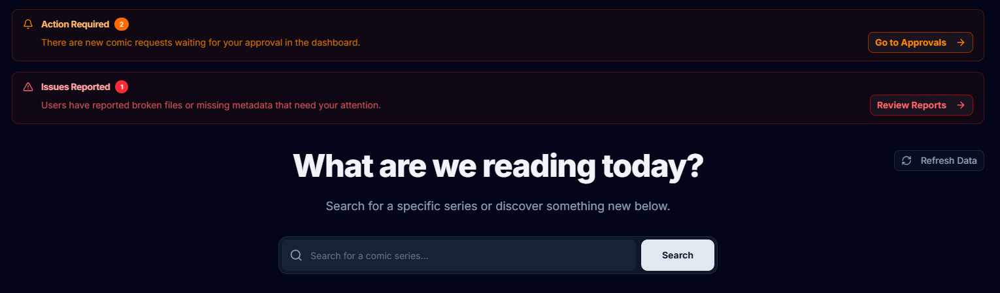
  <br>
  <strong>If a user submits an issue with a series or a request is waiting on admin approval, a banner will be visible to admins on the homepage.</strong>
</p>

### Library
A meticulously organized, highly performant view of your physical files, built to handle massive, multi-terabyte collections smoothly.

<p align="center">
  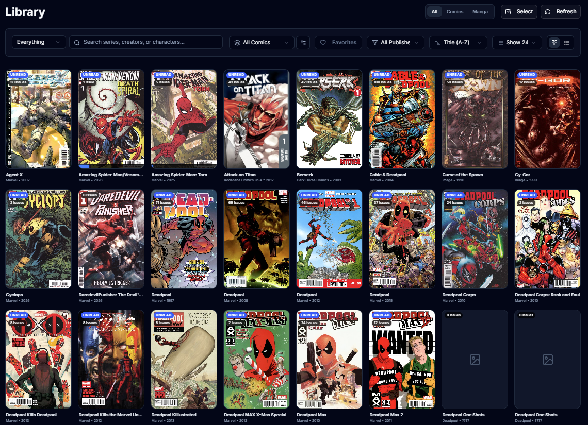
  <br>
  <strong>The library page which features infinite scrolling.</strong>
</p>

<p align="center">
  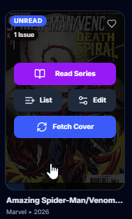
  <br>
  <strong>The library page action buttons.</strong>
</p>

* **Advanced Metadata Parsing:** Automatically matches metadata based on automatic imports from requests or when matching a manually added series using ComicVines api to accurately display titles, volume numbers, writers, artists, and summaries.
* **Series vs. Issue Hierarchy:** Automatically groups individual loose issues into their proper Series or Volume folders for a clean, uncluttered browsing experience.
* **Deep Filtering & Sorting:** * Filter your collection by Publisher (Marvel, DC, Image, etc.), Genre, Format (Comic vs. Manga vs. Magazine), and Status (Completed/Ongoing).
  * Filter by User Reading Status (Unread, In Progress, Read).
  * Sort by Recently Added, Release Date, Alphabetical, or Last Read.
* **Smart Progress Badging:** Visual overlay indicators on covers to instantly show reading progress bars and how many unread issues remain in a series.
* **Cross-Series Curations:** Create custom lists that span multiple series, volumes, and publishers seamlessly.
* **Issue Grid & List Modes:** Toggle between a visual cover grid or a condensed list view.

### Series Page
The dedicated hub for an individual comic run or manga volume. This page aggregates all metadata, reading progress, and file management for a specific series into one beautiful layout.

<p align="center">
  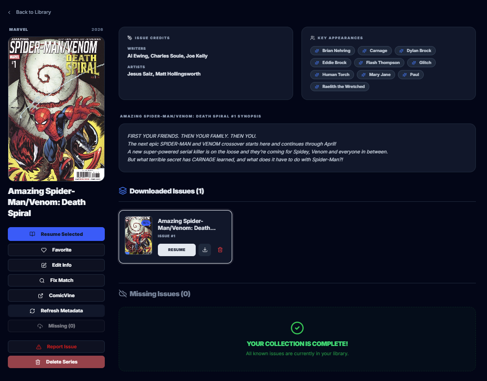
  <br>
  <strong>A series page showing a series that currently has all available issues.</strong>
</p>

<p align="center">
  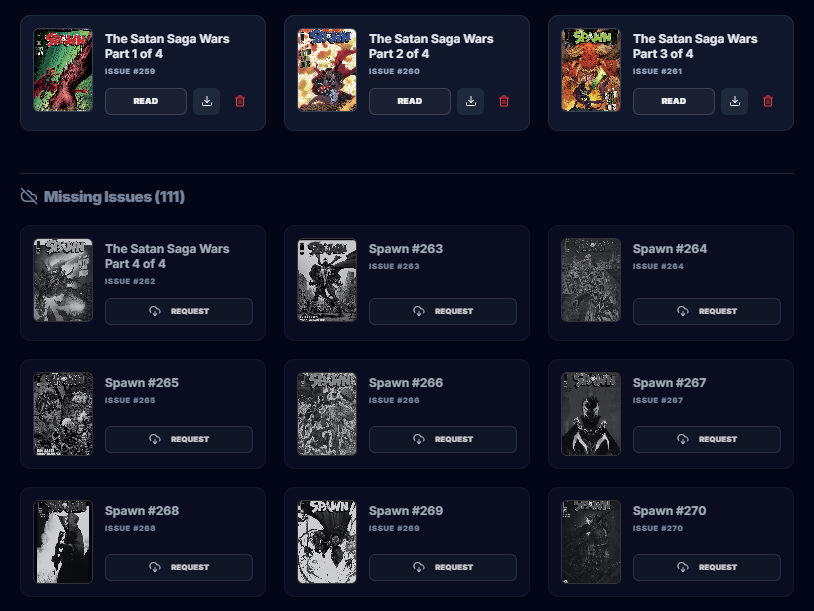
  <br>
  <strong>A series page showing a series that currently has all available issues.</strong>
</p>

* **Hero Banner & Synopsis:** A premium, visually striking header displaying high-resolution cover art, publisher logos, release years, and a full story synopsis pulled directly from embedded metadata or ComicVine.
* **Granular Metadata:** View detailed credits including Writers, Artists, Colorists, and Cover Artists, alongside genre tags and character appearances.
* **"Read Next" Prompts:** A smart action button that instantly opens the web reader to your exact saved page on the next unread issue in the run.
* **Issue Grid & List Modes:** *(Coming Soon)* Toggle between a visual cover grid or a condensed list view to easily navigate massive, 100+ issue runs.
* **Individual Progress Tracking:** Every issue displays its own distinct status (Unread, In Progress with a visual progress bar, or Read). 
* **Bulk Actions:** Effortlessly manage your collection with one-click buttons to "Mark All as Read," "Refresh Metadata," or delete specific files right from the browser.
* **Missing Issue Detection:** Visually highlights gaps in your collection (e.g., if you have issues #1, #2, and #4, it will flag #3 as missing) and offers a one-click button to send the missing issue to your download queue.
* **Sorting Options:** Sort issues sequentially (Issue #1 to #100) or reverse chronological (newest releases first) for ongoing weekly pulls.
* **Download Option:** Admins can enable a per-user permission for users to download individual issues for viewing offline if they have a comic reader.

### Web Reader
A completely custom, zero-friction reading experience built natively into the browser. No external apps required.
 * **Universal Format Support:** Native, blazing-fast extraction and rendering for `.cbz`, `.cbr`, `.zip`, `.rar`, and `.epub` archives.
* **Reading Directions:** One-click toggles for Left-to-Right (Standard Comics), Right-to-Left (Manga), and continuous Vertical Scrolling (Webtoons).
* **Dynamic Page Layouts:** * Choose between Single Page or Double Page spreads (perfect for splash pages).
  * Auto-Fit toggles: Fit to Width, Fit to Height, or Original Resolution.
* **Smart Preloading:** Silently caches the next several pages in the background so you never experience loading spinners while reading.
* **Control Schemes:** Fully mapped keyboard shortcuts for desktop readers (Arrow keys, Spacebar, F to Fullscreen), and intuitive tap/swipe zones for mobile and tablet users.
* **Brightness & Contrast Overlay:** Adjust the brightness of the reader independently of your device settings for late-night reading sessions.

### Reading Lists
Perfect for navigating the complex web of massive comic book crossover events or creating your own curated reading orders.

<p align="center">
  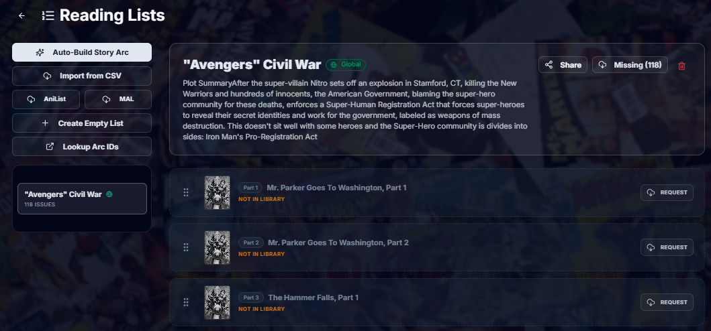
  <br>
  <strong>Reading lists page showing 2 story arcs added.</strong>
</p>

* **Event Tracking:** Build and follow complex chronological reading orders for major events (e.g., *Infinity Gauntlet*, *Secret Wars*, *Crisis on Infinite Earths*) without having to jump back and forth between folders.
* **Manual Drag-and-Drop:** Easily reorder issues within your lists with a simple drag-and-drop interface.
* **Dynamic Smart Lists:** Create lists that automatically populate based on tags, characters, or publishers.
* **Shareable Lists:** *(Coming Soon)* Import or export reading lists with the wider Omnibus community.

### User Profile & Preferences
A personalized space for each user on your server to manage their identity, track their unique reading habits, and customize their Omnibus experience to fit their workflow.

<p align="center">
  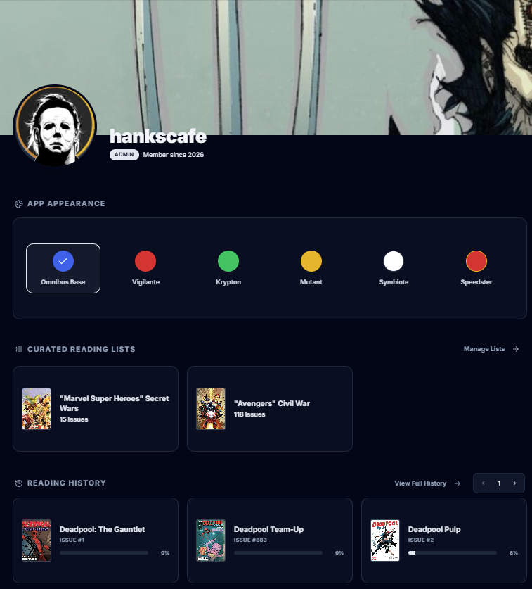
  <br>
  <strong>Users profile page showing customizable header and avatar.</strong>
</p>

<p align="center">
  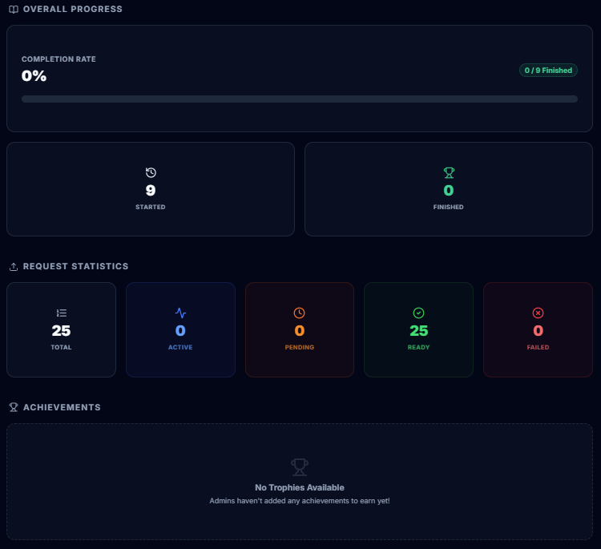
  <br>
  <strong>Users profile page reading progress cards.</strong>
</p>

<p align="center">
  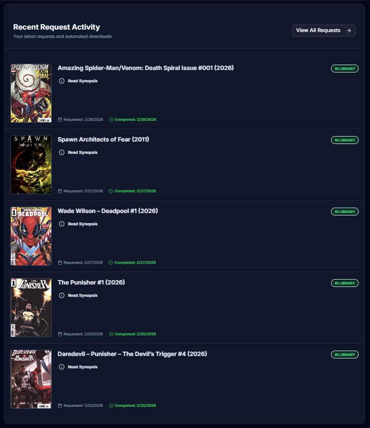
  <br>
  <strong>Users profile page showing recent request history.</strong>
</p>

<p align="center">
  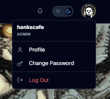
  <br>
  <strong>Users profile menu from header where you can log out or change password.</strong>
</p>

* **Personal Identity:** Customize your account by uploading a unique profile avatar and a custom hero banner for your user dashboard.
* **Reading Statistics:** Track your all-time reading habits. View your total issues read, estimated pages turned, and your most-read publishers or genres.
* **UI Customization:** Set your own personal theme preferences (Dark mode, Light mode, or System default) and UI accent colors. These settings are tied to your account and persist across any device you log into.
* **Default Reader Settings:** Save your preferred Web Reader behaviors (e.g., always default to "Fit to Width" or default to "Right-to-Left" for manga libraries) so you never have to adjust settings when starting a new book.
* **Account Security:** Safely update your password and view or revoke active login sessions *(Coming Soon)* across your different devices.
* **Personal API Keys:** *(Coming Soon)* Generate secure, user-specific API tokens to integrate your Omnibus reading progress with third-party trackers (like MyAnimeList, AniList, or custom scripts) without giving out Admin access.
* **Theme Customization:** Toggle Dark/Light modes, adjust UI accent colors, and tailor the app to your visual preferences.

### Settings & Administration
Complete, granular control over your instance, your users, and your underlying automation.

<p align="center">
  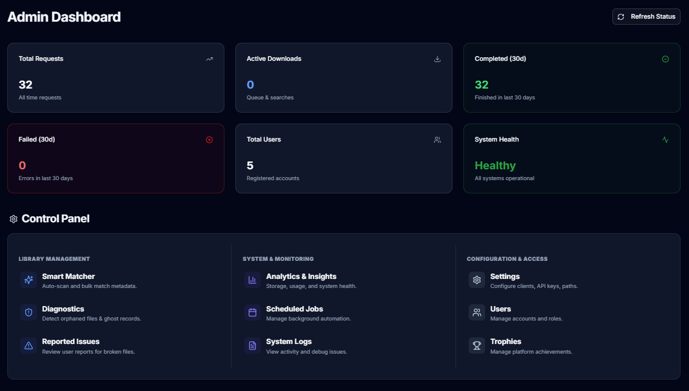
  <br>
  <strong>Admin page showing data cards and configuration pages.</strong>
</p>

<p align="center">
  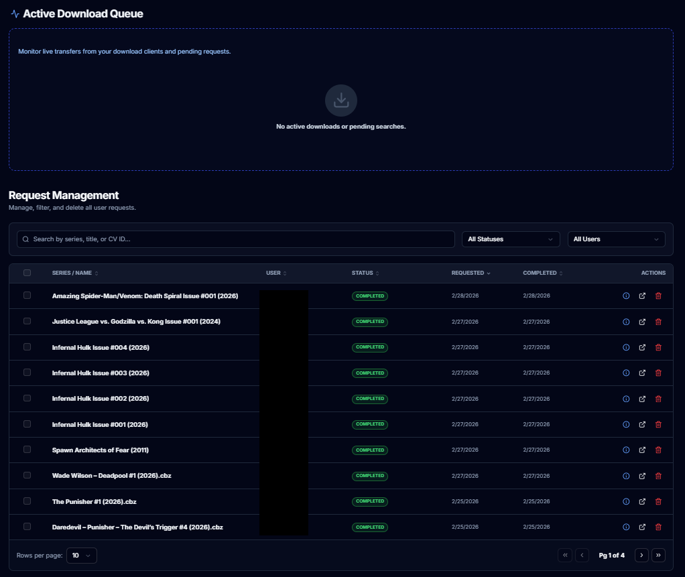
  <br>
  <strong>Admin page showing active downloads and request management sections.</strong>
</p> 

* **Download Client Integration:** Connects seamlessly with your favorite Torrent clients (qBittorrent, Transmission) and USENET clients (SABnzbd, NZBGet) behind the scenes.
* **Indexer Support:** Plug in Prowlarr or Jackett to search dozens of trackers simultaneously.
* **Queue & History Management:** View active, pending, paused, and completed downloads with real-time progress bars, speeds, and ETA.
* **Automated Post-Processing:** Once a comic is downloaded, Omnibus automatically:
  1. Extracts the file (if necessary).
  2. Renames the file to your customized standard format.
  3. Moves it to the correct publisher/series directory on your NAS.
  4. Triggers a local library scan to make it instantly readable.
* **User & Role Management:** * Create independent accounts for friends and family so everyone has their own reading progress.
  * Admin or User roles
  * Users can be assigned auto-approval permission and download permission
* **Library Path Mapping:** Easily map multiple root directories from your NAS (e.g., separate folders for `/comics`, `/manga`, and `/magazines`).
* **API & Service Configuration:** Securely plug in your ComicVine API keys, Indexer credentials, and Download Client details.
* **Scheduled Tasks (Cron):** Configure how often Omnibus should scan your disk for new files, refresh metadata, or check indexers for missing requested issues.
* **System Logs:** A built-in log viewer to easily troubleshoot API limits, failed downloads, or matching errors.

---

## Additional Screenshots

<table align="center" style="border: none;">
  <tr>
    <td align="center">
      <a href="docs/images/analytics_1.png">
        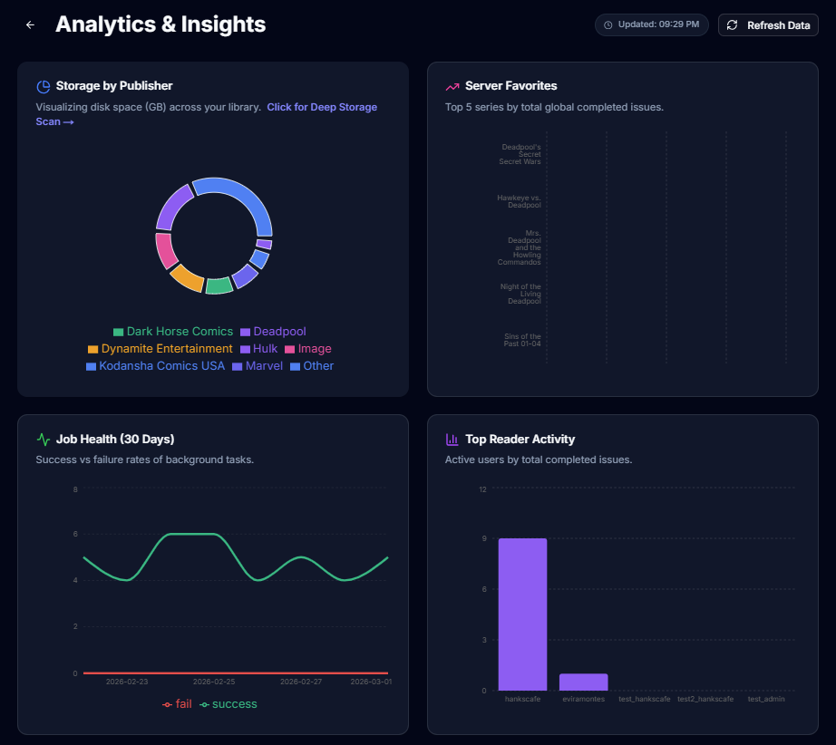
      </a>
    </td>
    <td align="center">
      <a href="docs/images/analytics_2.png">
        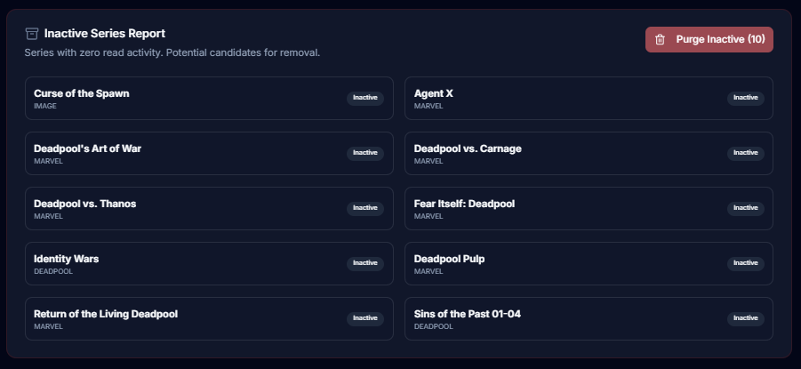
      </a>
    </td>
    <td align="center">
      <a href="docs/images/approvals.png">
        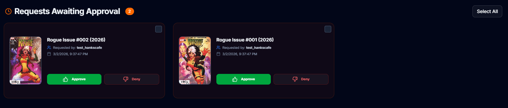
      </a>
    </td>
  </tr>
  <tr>
    <td align="center">
      <a href="docs/images/diagnostics.png">
        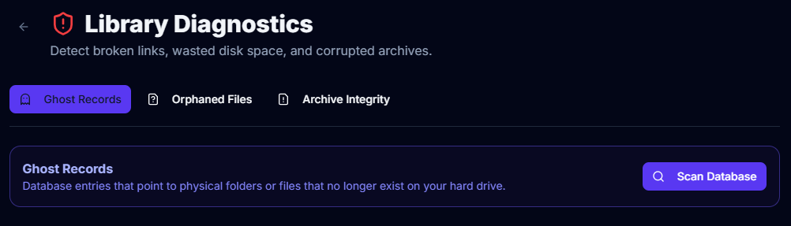
      </a>
    </td>
    <td align="center">
      <a href="docs/images/issue_reports_1.png">
        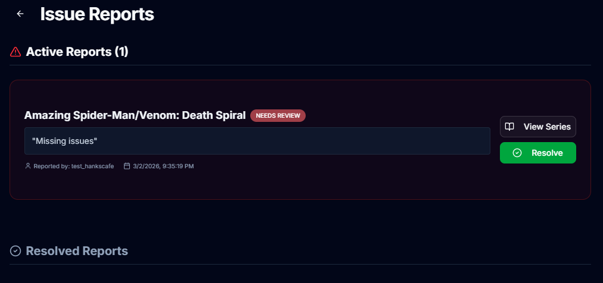
      </a>
    </td>
    <td align="center">
      <a href="docs/images/issue_reports_2.png">
        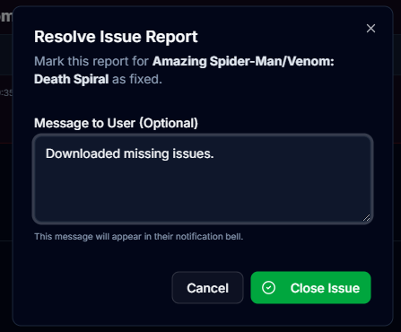
      </a>
    </td>
  </tr>
  <tr>
    <td align="center">
      <a href="docs/images/issue_reports_3.png">
        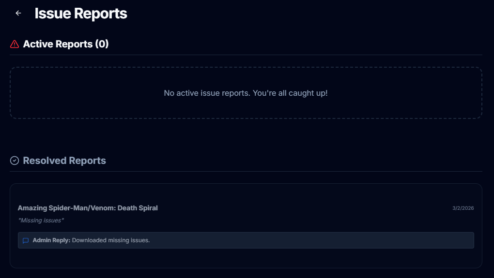
      </a>
    </td>
    <td align="center">
      <a href="docs/images/my_requests.png">
        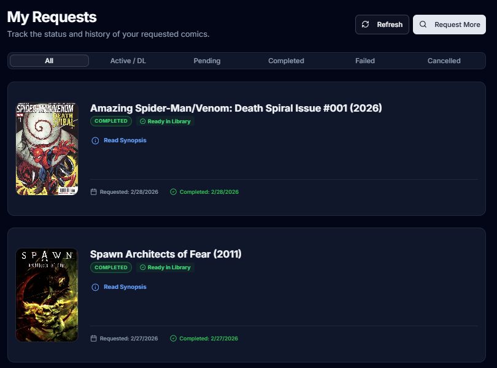
      </a>
    </td>
    <td align="center">
      <a href="docs/images/smart_matcher.png">
        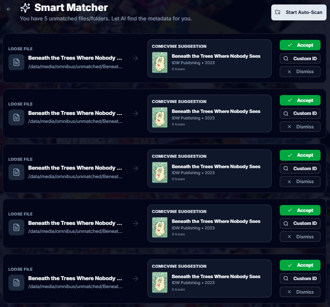
      </a>
    </td>
  </tr>
  <tr>
    <td align="center">
      <a href="docs/images/storage_deep_dive.png">
        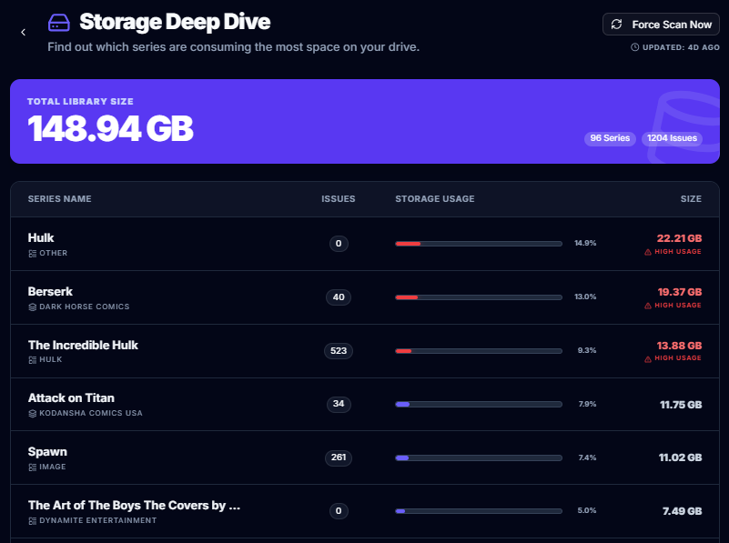
      </a>
    </td>
    <td align="center">
      <a href="docs/images/system_logs_1.png">
        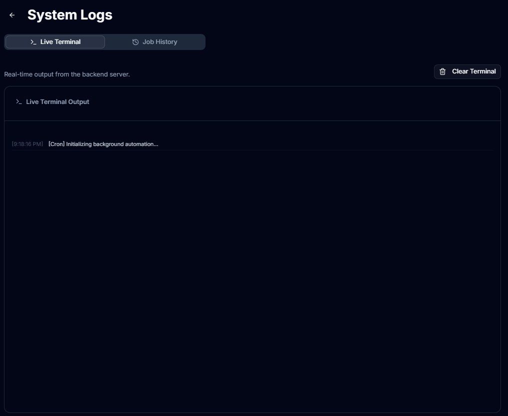
      </a>
    </td>
    <td align="center">
      <a href="docs/images/system_logs_2.png">
        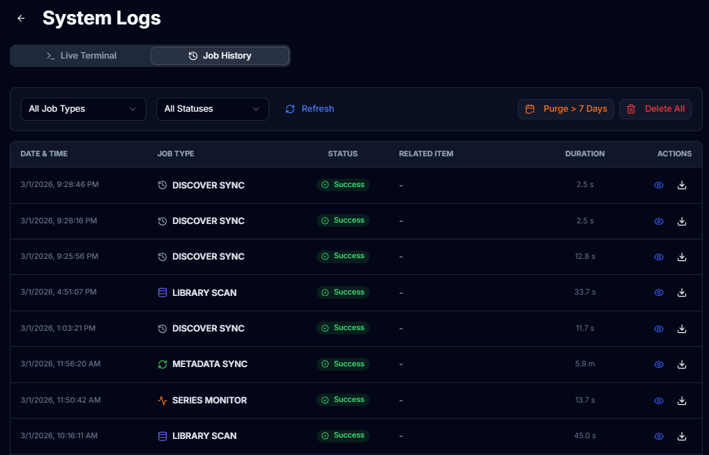
      </a>
    </td>
  </tr>
  <tr>
    <td align="center">
      <a href="docs/images/users.png">
        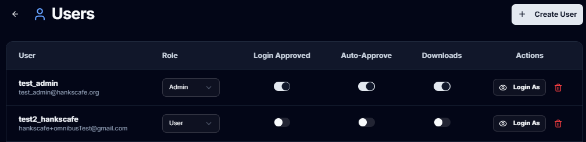
      </a>
    </td>
    <td></td>
    <td></td>
  </tr>
</table>

---

## Installation (Docker)

Omnibus is built to be deployed via Docker. Because it utilizes a serverless SQLite engine through Prisma, **all necessary database files and dependencies are bundled directly into the image.** There are no external database containers required!

1. Save the following as `docker-compose.yml`:

```yaml
version: '3.8'

services:
  omnibus:
    image: ghcr.io/hankscafe/omnibus:latest
    container_name: omnibus
    restart: unless-stopped
    ports:
      - "3000:3000"
    environment:
      # REQUIRED: Change to your NAS IP or your domain (e.g., [https://omnibus.mydomain.com](https://omnibus.mydomain.com))
      - NEXTAUTH_URL=[http://192.168.1.100:3000](http://192.168.1.100:3000) 
      # REQUIRED: Generate a random string for security
      - NEXTAUTH_SECRET=super_secret_generated_key_123!
    volumes:
      # Map your local config folder to store the SQLite database securely on your NAS
      - /path/to/your/nas/config:/app/prisma
      # Map your comic/manga storage directories
      - /path/to/your/nas/comics:/comics
      - /path/to/your/nas/downloads:/downloads
```

2. Run `docker-compose up -d`.
3. Open your browser and navigate to your `NEXTAUTH_URL` to access the Setup Wizard!

---

## Acknowledgements

Omnibus stands on the shoulders of giants. This project was heavily inspired by and built with immense respect for the developers of the following incredible self-hosted applications:

* **[Kavita](https://www.kavitareader.com/):** For setting the gold standard in self-hosted reading and library management.
* **[Komga](https://komga.org/):** For their incredible work in the digital comic management space.
* **[Kapowarr](https://github.com/Casvt/Kapowarr):** For pioneering modern comic book request and download automation.
* **[Mylar3](https://github.com/mylar3/mylar3):** The absolute titan of comic tracking and downloading that paved the way.
* **[ReadMeABook](https://github.com/kikootwo/ReadMeABook):** For the beautiful UI/UX inspiration and demonstrating what a modern web reader can look like.
* **[ComicVine](https://comicvine.gamespot.com/):** For providing the API and metadata backbone that keeps our digital collections accurate and beautiful.